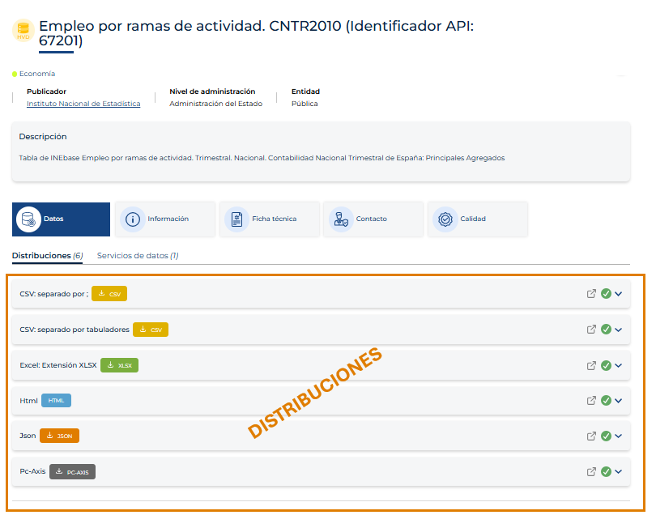
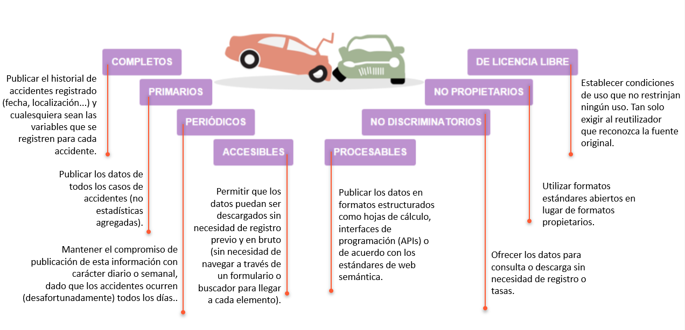

<!--
module_id: unidad-formativa-01
author: Equipo gestor de la plataforma datos.gob.es
email: contacto@datos.gob.es
date: 26/01/2026
version: 1.0.0
language: es
narrator: Spanish Female
mode: Textbook
title: Unidad 01 - Datos abiertos: conceptos básicos y beneficios
comment: Esta unidad presenta los conceptos básicos, principios y beneficios de los datos abiertos.
long_description: Unidades didácticas. Unidad 01 - Datos abiertos: conceptos básicos y beneficios. Más información en [datos.gob.es](https://datos.gob.es/)

edit: true

repository: https://github.com/datosgobes/unidad-formativa-01

logo:     https://cdn.jsdelivr.net/gh/datosgobes/materiales-formativos@main/assets/img/logo_dge_square.svg

icon:     https://cdn.jsdelivr.net/gh/datosgobes/materiales-formativos@main/assets/img/logo_dge_normal.svg

dark:   false

script: https://cdn.jsdelivr.net/chartist.js/latest/chartist.min.js

link: https://fonts.googleapis.com/css2?family=Montserrat:ital,wght@0,100..900;1,100..900&display=swap
      https://cdn.jsdelivr.net/gh/datosgobes/materiales-formativos@main/assets/css/dge-styles.css

font: Montserrat

import: https://raw.githubusercontent.com/liaScript/mermaid_template/master/README.md

import: https://raw.githubusercontent.com/LiaTemplates/Communica/0.0.2/README.md

attribute: Iniciativa de datos abiertos del Gobierno de España [CC BY 4.0](https://creativecommons.org/licenses/by/4.0/)
-->

# Unidad 01 - Datos abiertos: conceptos básicos y beneficios

<ul class="logo-list primary-logos">
  <li></li>
  <li></li>
  <li></li>
</ul>

[preview-lia](https://raw.githubusercontent.com/datosgobes/unidad-formativa-01/refs/heads/main/README.md)

	

		<a href="https://liascript.github.io/course/?https://raw.githubusercontent.com/datosgobes/unidad-formativa-01/refs/heads/main/CURSO.md#3" class="pdf-download-btn" style="font-size:1.75em; padding:1rem 1.6rem; font-weight:800;">
      ▶️ Empezar curso
    </a>
  

  

    <a href="https://github.com/datosgobes/unidad-formativa-01/releases/download/latest/documentation-unidad-formativa-01.pdf" target="_blank" rel="noopener" class="pdf-download-btn" style="font-size:0.95em; padding:0.55rem 0.9rem; background:#6b7280; color:#ffffff;">
      📄 PDF
    </a>
    <a href="https://github.com/datosgobes/unidad-formativa-01/releases/download/latest/scorm-unidad-formativa-01.zip" target="_blank" rel="noopener" class="pdf-download-btn" style="font-size:0.95em; padding:0.55rem 0.9rem; background:#6b7280; color:#ffffff;">
      📦 SCORM
    </a>
    <a href="https://github.com/datosgobes/unidad-formativa-01/releases/download/latest/ims-unidad-formativa-01.zip" target="_blank" rel="noopener" class="pdf-download-btn" style="font-size:0.95em; padding:0.55rem 0.9rem; background:#6b7280; color:#ffffff;">
      📚 IMS
    </a>
  

  
Empezar el curso o descargar documentación

  

    Esta unidad ha sido elaborada en el marco de la <a href="https://datos.gob.es/es/que-hacemos" target="_blank" rel="noopener">Iniciativa Aporta (datos.gob.es)</a>, desarrollada por el <a href="https://digital.gob.es/" target="_blank" rel="noopener">Ministerio para la Transformación Digital y de la Función Pública</a> a través de la <a href="https://www.red.es/" target="_blank" rel="noopener">Entidad Pública Empresarial Red.es</a>
  

   
  

    <strong style="font-size:1.05em;">📝 Aviso legal</strong>
  

  

    Esta obra está sujeta a una licencia Atribución 4.0 de Creative Commons (CC BY 4.0). Está permitida su reproducción, distribución, comunicación pública y transformación para generar una obra derivada, sin ninguna restricción, siempre que se cite al titular de los derechos (<i>Ministerio para la Transformación Digital y de la Función Pública a través de la Entidad Pública Empresarial Red.es</i>). La licencia completa se puede consultar en: <a href="https://creativecommons.org/licenses/by/4.0" target="_blank" rel="noopener">Attribution 4.0 International</a>
  

## TUTORIAL

{{|>}}
*************************************************************************************************************

  

		⚠️ Aviso
	

	

		

			Este curso está diseñado en <a href="https://liascript.github.io/" target="_blank" rel="noopener">LiaScript</a>. Para disfrutarlo con todas sus funcionalidades, accede a <a href="https://liascript.github.io/course/?https://raw.githubusercontent.com/datosgobes/unidad-formativa-01/refs/heads/main/CURSO.md" target="_blank" rel="noopener">este enlace</a>.
			

			

			Para conocer más sobre el formato Markdown utilizado por LiaScript, consulta la <a href="https://liascript.github.io/course/?https://raw.githubusercontent.com/liaScript/docs/master/README.md" target="_blank" rel="noopener">documentación oficial</a>.
		

	

{{1}}
Puedes navegar el curso a través del índice de la parte izquierda o usando las flechas de navegación del teclado o de la parte inferior de la web.

{{2}}
Al finalizar cada sección, tendrás la oportunidad de responder preguntas para comprobar tu aprendizaje. Estas actividades solo están disponibles en la versión LiaScript, no en Markdown estándar.

??[Cuestionario](https://liascript.github.io/course/?https://raw.githubusercontent.com/datosgobes/unidad-formativa-01/refs/heads/main/CURSO.md#cuestionario-final)

{{3}}

Recursos disponibles:

- 📖 <strong>Fuente</strong>: origen de la definición o de la información que respalda el concepto o información que se está presentando.
- 🧭 <strong>Ejemplo</strong>: casos concretos que facilitan la comprensión.
- ⚠️ <strong>Aviso</strong>: consejo o dato práctico para entender lo presentado.
- ℹ️ <strong>Más información</strong>: material de relevancia que complementa lo explicado.
- 🔍 <strong>Saber más</strong>: referencias y documentos adicionales.
- 🧪 <strong>Caso de estudio</strong>: casos reales para afianzar conocimientos.
- ✏️ <strong>Ejercicio</strong>: actividades para aplicar los conocimientos adquiridos.

{{4}}
Existe la opción de seleccionar otro idioma para el curso usando la traducción -si existe aparecen listados- o seleccionando el servicio de traducción automática con un solo clic. Ten presente que la traducción automática puede contener errores o interpretaciones incorrectas de algunos conceptos.

{{5}}
El curso incluye secciones con narración de audio. Puedes activar o desactivar la narración utilizando el botón situado en la parte superior de cada página.

*************************************************************************************************************

## INFORMACIÓN INICIAL

{{|>}}
*************************************************************************************************************

__Título de la unidad__

¿Qué son los datos abiertos? Conceptos básicos, principios y beneficios.

__Descripción de la unidad__

La unidad ofrece una visión general de qué son los datos abiertos, cómo se usan y qué beneficios aportan en términos de accesibilidad, reutilización, transparencia y valor social y económico.

---

!?[Vídeo descriptivo de la unidad](https://www.youtube.com/watch?v=UM9aGVdHuyU)

*************************************************************************************************************

## OBJETIVOS DIDÁCTICOS

{{|>}}
*************************************************************************************************************

Comenzamos presentando los **objetivos didácticos** de esta unidad:

> - Establecer **conceptos básicos** relacionados con los datos abiertos tomando como referencia el marco legislativo vigente en España.
> - Reconocer los **principios generales** a tener en cuenta para asegurar que los datos abiertos son fácilmente reutilizables.
> - Descubrir los principales **beneficios económicos y sociales** que supone la apertura de datos públicos.
> - Conocer los **aspectos clave ligados al ecosistema de los datos** de cara a asegurar la generación de los beneficios apuntados.

*************************************************************************************************************

## CONTENIDOS

{{|>}}
*************************************************************************************************************

{{1}} **[INTRODUCCIÓN](#introducción)**  

{{2}} **[CONCEPTOS CLAVE](#conceptos-clave)** 

{{3}} **[PRINCIPIOS DE APERTURA DE DATOS](#principios)**  

{{4}} **[BENEFICIOS DE LA REUTILIZACIÓN DE DATOS ABIERTOS](#beneficios)** 

{{5}} **[CUESTIONARIO FINAL](#cuestionario-final)**  

{{6}} **[RESUMEN](#resumen)**

*************************************************************************************************************

## PÚBLICO OBJETIVO

{{|>}}
*************************************************************************************************************

Esta unidad formativa está dirigida a:

> - [x] Publicadores de datos abiertos y reutilizadores de los mismos.

*************************************************************************************************************

## CONOCIMIENTOS PREVIOS NECESARIOS

{{|>}}
*************************************************************************************************************

Para poder asimilar los conceptos que vamos a desarrollar en la unidad:

> - [x] No se precisan conocimientos previos.

*************************************************************************************************************

<!-- id="introduccion" -->
## INTRODUCCIÓN

{{|>}}
*************************************************************************************************************

En la sociedad actual **los datos se han convertido en un activo fundamental**, tanto para las personas como para las organizaciones. El dato, y su papel esencial en el desarrollo de tecnologías disruptivas como la inteligencia artificial, supone el factor diferencial de la revolución industrial y tecnológica en la que nos encontramos inmersos.

Los datos generados por las administraciones públicas fruto de su actividad —los **datos del sector público**— despiertan un gran interés:

- Para la ciudadanía, porque son una herramienta clave para la **transparencia y la participación democrática**.
- Para las empresas, porque representan una fuente valiosa para **mejorar la competitividad** en distintos sectores.
- Para las propias administraciones, porque facilitan la **definición y optimización de políticas públicas**.

Los datos producidos por las administraciones en el ejercicio de sus funciones deben ponerse a disposición de la sociedad como **datos abiertos**: **accesibles y disponibles para todos, sin restricciones legales ni técnicas**.

Los datos procedentes de múltiples ámbitos —geográfico, medioambiental, meteorológico, turístico, empresarial, educativo, entre otros— conforman un conjunto amplio, diverso y valioso. Publicados como datos abiertos, pueden y deben generar beneficios para toda la sociedad.

*************************************************************************************************************

<!-- id="conceptos-clave" -->
## CONCEPTOS CLAVE

{{|>}}
*************************************************************************************************************

Como punto de partida se definen los conceptos básicos que se manejan al hablar de datos en general y de datos abiertos en particular. Se toma como referencia el marco legislativo vigente en España.

*************************************************************************************************************

### Bloque I: Conceptos básicos

{{|>}}
*************************************************************************************************************

**Dato:** toda representación digital de actos, hechos o información, así como su recopilación, incluso como grabación sonora, visual o audiovisual. [📖 Fuente](https://www.boe.es/buscar/act.php?id=BOE-A-2010-1331)

Los datos pueden ser **estructurados** y **no estructurados**:

- **Estructurados**: tienen bien definidos su longitud y su formato, como las fechas, los números o las cadenas de caracteres. Se almacenan en tablas.
- **No estructurados**: carecen de un formato específico. No se pueden almacenar dentro de una tabla.

	

		🧭 Ejemplo
	

	

		<ul style="margin:0.25rem 0 0.5rem 0;">
			<li><strong>Dato:</strong> 15°C.
			 - Es un valor aislado, sin contexto. Solo sabemos que es una temperatura.</li>
			<li><strong>Información:</strong> la temperatura en Valladolid hoy es de 15°C.
			 - El dato se contextualiza: sabemos dónde y cúando se aplica.</li>
			<li><strong>Conocimiento:</strong> si la temperatura en Valladolid es de 15°C en enero, es inusualmente alta.
			 - Se interpreta la información, se relaciona con experiencia y se extraen conclusiones útiles.</li>
		</ul>
	

**Datos abiertos:** cualquiera es libre de utilizar, reutilizar y redistribuir, con el único límite, en su caso, del requisito de atribución de su fuente o el reconocimiento de su autoría. [📖 Fuente](https://www.boe.es/buscar/act.php?id=BOE-A-2007-19814)

Esta definición identifica tres características esenciales:

- **Uso libre**: pueden emplearse para cualquier finalidad, incluida la comercial.
- **Reutilización**: posibilidad de transformar, combinar o enriquecer los datos.
- **Redistribución**: posibilidad de compartir datos originales o derivados.

")

**Lo que NO son datos abiertos**

- Datos publicados sin licencia clara (genera inseguridad jurídica).
- Datos accesibles solo previo registro o pago.
- Datos con restricciones de privacidad o seguridad (ej: datos personales).

  

		⚠️ Aviso
	

	

		

			En la práctica, esto significa que:
		<ul style="list-style-type: disc; margin-left: 1.5em;">
			<li>Un ayuntamiento publica sus presupuestos anuales como datos abiertos: ciudadanos y periodistas pueden analizarlos.</li>
			<li>El Ministerio de Transportes ofrece datos de tráfico en tiempo real: desarrolladores crean aplicaciones de movilidad.</li>
			<li>El Instituto Nacional de Estadística publica datos demográficos: investigadores los usan para estudios socioeconómicos.</li>
		</ul>
		

	

**Licencia abierta:** acuerdo legal que otorga permisos de libre uso, modificación y distribución de un recurso, exigiendo únicamente **el reconocimiento del autor** y la continuidad de la propia licencia abierta. Las licencias Creative Commons (CC) es el ejemplo más popular para contenidos y datos, y en concreto, las mostradas en este esquema, las más habituales en el contexto de los datos abiertos.

")

	

		🧭 Ejemplo
	

	

		

			El Instituto Geográfico Nacional ofrece información geográfica digital de España reutilizable y gratuita bajo una licencia **CC-BY 4.0.** [📖 Fuente](https://centrodedescargas.cnig.es/CentroDescargas/politica-datos) 
		

	

  

    ℹ️ Más información
  

  

    

      [La importancia de las licencias en el entorno digital: un enfoque accesible para todos](https://datos.gob.es/es/noticias/licencias-de-uso-asociadas-las-iniciativas-de-datos-abiertos-en-espana)
    

  

**Datos abiertos gubernamentales o del sector público:** son datos generados, creados, recolectados, procesados, preservados, mantenidos, diseminados o financiados por un gobierno o una institución pública, y que consideran los requerimientos y restricciones legales que permiten su reutilización -licencia abierta-. Son datos con un gran potencial. [📖 Fuente](https://ideas.repec.org/p/oec/govaaa/22-en.html).

**Las administraciones públicas son los principales proveedores de datos abiertos**. Por esta razón, cuando hablamos de datos abiertos, generalmente se hace referencia a datos oficinales gubernamentales disponibles como abiertos.

	

		🧭 Ejemplo
	

	

		

			El Instituto Nacional de Estadística (INE) publica datos de población, que actualiza periódicamente. [📖 Fuente](https://www.ine.es/dyngs/INEbase/categoria.htm?c=Estadistica_P&cid=1254735572981/)
		

	

**Datos abiertos de alto valor (HVD** por sus siglas en inglés): datos cuya reutilización está asociada a considerables **beneficios para la sociedad, el medio ambiente y la economía**, en particular debido a su idoneidad para la creación de servicios de valor añadido, aplicaciones y puestos de trabajo nuevos, dignos y de calidad, y del número de beneficiarios potenciales de los servicios de valor añadido y aplicaciones basados en tales conjuntos de datos. [📖 Fuente](https://www.boe.es/buscar/act.php?id=BOE-A-2007-19814#:~:text=Subir-,%5BBloque%207%3A%20%23a3%2D3%5D,-Art%C3%ADculo%203.ter)

En enero de 2023, la Comisión Europea define seis categorías para diferenciar los datos de alto valor [📖 Fuente](https://datos.gob.es/es/catalogo/conjuntos-datos?is_hvd=true)

 ") 

  

    ℹ️ Más información
  

  

    

      [Europa define los conjuntos de datos de alto valor que el sector público tendrá que abrir como máximo en 2024](https://datos.gob.es/es/noticias/europa-define-los-conjuntos-de-datos-de-alto-valor-que-el-sector-publico-tendra-que-abrir)
    

  

	

		🧭 Ejemplo
	

	

		

			A través del Cátalogo Nacional diferentes organismos publican datos de alto valor (HVD) [📖 Fuente](https://datos.gob.es/es/catalogo/conjuntos-datos?is_hvd=true) 
		

	

**Datos protegidos:** datos que obran en poder de organismos del sector público que estén protegidos por motivos de:

<ol type="a" style="list-style-type: lower-alpha; margin:0.25rem 0 0.5rem 0; padding-left: 1.5em;">
  <li>confidencialidad comercial, incluidos los secretos comerciales, profesionales o empresariales</li>
  <li>confidencialidad estadística</li>
  <li>protección de los derechos de propiedad intelectual de terceros, o</li>
  <li>protección de los datos personales</li>
</ol>

La Ley de Gobernanza de Datos (DGA) establece el marco para este tipo de datos. Norma complementaria de la Directiva de 2019, que rige el ámbito de los datos abiertos. [📖 Fuente](https://eur-lex.europa.eu/legal-content/ES/TXT/PDF/?uri=CELEX:32022R0868)

  

		⚠️ Aviso
	

	

		

			Los datos protegidos son aquellos datos que las administraciones no pueden disponer como datos abiertos pues en ellos concurren derechos de terceros que dificultan su reutilización: datos de carácter personal, datos con derechos de propiedad intelectual, entre otros. 
		

	

  

    ℹ️ Más información
  

  

	

	<ul style="list-style-type: disc; margin-left: 1.5em;">
		<li>[La aplicación del Reglamento UE sobre Gobernanza de Datos en las Administraciones Públicas](https://datos.gob.es/es/blog/la-aplicacion-del-reglamento-ue-sobre-gobernanza-de-datos-en-las-administraciones-publicas)</li>
		<li>[Infografía: Reglamento Europeo de Gobernanza de Datos](https://datos.gob.es/sites/default/files/blog/file/infografia-doble-reglamento-europeo-es_0.pdf)</li>
		<li>[La protección de datos personales en el borrador del Reglamento de Gobernanza de los Datos (Data Governance Act)](https://datos.gob.es/es/blog/la-proteccion-de-datos-personales-en-el-borrador-del-reglamento-de-gobernanza-de-los-datos-data)</li>
		<li>[Las salas seguras en España: ¿A qué tipo de datos pueden acceder los investigadores?](https://datos.gob.es/es/blog/las-salas-seguras-en-espana-que-tipo-de-datos-pueden-acceder-los-investigadores)</li>
	</ul>
	

  

*************************************************************************************************************

### Bloque II: conceptos relacionados con la publicación

{{|>}}
*************************************************************************************************************

**Conjunto de datos**: datos relacionados, convenientemente estructurados y organizados, de forma que puedan ser tratados (procesados) apropiadamente para obtener información. [📖 Fuente](https://administracionelectronica.gob.es/pae_Home/dam/jcr%3A86742046-a129-4c69-96de-9193f2a191c7/Guia_de_aplicacion_RD1495_Publicacion_oficial_2012.pdf)

	

		🧭 Ejemplo
	

	

		

			La Dirección General de Tráfico (DGT) publica un conjunto de datos en formato XLS con las series históricas de matriculaciones desde 1998 a 2024. [📖 Fuente](https://datos.gob.es/es/catalogo/e00130502-matriculaciones-series-historicas-2024) 
		

	

**Servicio de datos**: conjunto de operaciones que ofrecen acceso a uno o más conjuntos de datos o funciones de procesamiento permitiendo obtener datos en distintos formatos.
A los servicios de datos se accede principalmente mediante API (Interfaz de Programación de Aplicaciones), que actúa como un puente para acceder a los datos de un sistema sin necesidad de conocer su implementación interna.

	

		🧭 Ejemplo
	

	

		

			La Agencia Estatal de Meteorología (AEMET) publica una API de datos meteorológicos que permite que una aplicación consulte la temperatura actual mediante una llamada programada. [📖 Fuente](https://opendata.aemet.es/centrodedescargas/inicio) 
		

	

  

    ℹ️ Más información
  

  

    

      [APIs para el acceso a datos abiertos](https://datos.gob.es/es/blog/apis-para-el-acceso-datos-abiertos)
    

  

  

		⚠️ Aviso
	

	

		

			Es importante no confundir entre servicio de datos y API. El **servicio de datos** es el “repositorio” o fuente donde están los datos. La **API** es la “puerta de acceso programática” que permite interactuar con esos datos de forma dinámica y automatizada.
		

	

**Distribución:** información (datos) en un formato concreto, accesible desde un URL específica. Un conjunto de datos puede disponer de una o múltiples distribuciones. [📖 Fuente](https://www.boe.es/buscar/doc.php?id=BOE-A-2013-2380) 

	

		🧭 Ejemplo
	

	

		

			El Instituto Nacional de Estadística publica datos sobre residuos alimentarios por actividad económica. Los datos se sirven como [servicio API](https://datos.gob.es/es/catalogo/ea0010587-distribucion-porcentual-del-residuo-alimentario-por-actividad-economica-cnae-2009-identificador-api-67542) y como [ficheros con diferentes formatos](https://datos.gob.es/es/catalogo/ea0010587-distribucion-porcentual-del-residuo-alimentario-por-actividad-economica-cnae-2009-identificador-api-67542), lo que referimos como diferentes distribuciones: CSV, XLSX, JSON, PC-AXIS, entre otros.
       
      Además del servicio API, que permite acceder mediante consultas dinámicas a los datos mencionados, el INE ofrece datasets en CSV y JSON, entre otros formatos.
		

	

  

    🔍 Saber más
  

  

	  

      Cada formato tiene diferentes peculiaridades. Los más comunes son los siguientes:
	    <ul style="list-style-type: disc; margin-left: 1.5em;">
      <li>CSV: simple, universal y legible por máquina</li>
      <li>XLSX: familiar para usuarios de Excel</li>
      <li>JSON/JSON-LD: estructurado, ideal para su uso por API</li>
      <li>PC-AXIS: habitual para datos estadísticos </li>
    </ul>
    

  

  

    ⚠️ Aviso
  

  

    

      El concepto de distribución en ocasiones se refiere a la forma de ofrecer los datos para su descarga o uso. Es decir, se pueden diferenciar distribuciones no solo por formato del fichero sino también en base a otros criterios como puede ser el periodo temporal al que se refiere la información. De esta forma, cada fichero de datos correspondiente a un periodo es una distribución, siempre que ese fichero se publique como una unidad de acceso independiente. Ver ejemplo a continuación. 
    

  

  

    🧭 Ejemplo
  

  

    

      <strong>Población residente por municipio</strong>, que representa una serie temporal con periodicidad anual
    

    

      <strong>Ficheros publicados:</strong>
    

    <ul style="list-style-type: disc; margin-left: 1.5em; margin-bottom: 0.5rem;">
      <li>poblacion_2021.csv</li>
      <li>poblacion_2022.csv</li>
      <li>poblacion_2021.json</li>
      <li>poblacion_2022.json</li>
    </ul>
    

      <strong>Modelado correcto:</strong>
    

    <ul style="list-style-type: disc; margin-left: 1.5em; margin-bottom: 0.5rem;">
      <li>1 dataset: describe la serie temporal completa en diferentes formatos</li>
      <li>4 distribuciones: cada una corresponde a un año concreto o a un formato</li>
    </ul>
  

**Metadatos:** datos que definen y describen otros datos. Es información estructurada que describe, explica o localiza un conjunto de datos o un servicio de datos, haciendo más sencilla la recuperación de información, utilización o administración de dicho conjunto de datos [📖 Fuente](https://www.boe.es/buscar/act.php?id=BOE-A-2010-1331#:~:text=Subir-,%5BBloque%2056%3A%20%23an%5D,-ANEXO) 

	

		🧭 Ejemplo
	

	

		

			El Instituto Nacional de Estadística publica los consumos energéticos anualmente. El conjunto de datos cuenta, entre otros, con los siguientes metadatos:
       
			<strong>Título:</strong> Consumos energéticos por año, comunidades y ciudades autónomas y producto consumido
			 <strong>Descripción:</strong> tabla de INEbase Consumos energéticos por año, comunidades y ciudades autónomas y producto consumido. Encuesta de Consumos Energéticos
			 <strong>Frecuencia de actualización:</strong> Anual
			 <strong>Licencia:</strong> https://www.ine.es/aviso_legal
			 <strong>Fecha de última actualización:</strong> 26/05/2025
			 <strong>Otros recursos:</strong> https://www.ine.es/dyngs/IOE/es/operacion.htm?numinv=30070
    

	

  

    ℹ️ Más información
  

  

    

      <ul style="list-style-type: disc; margin-left: 1.5em;">
        <li><a href="https://datos.gob.es/es/blog/importancia-de-la-catalogacion-de-datos">Importancia de la Catalogación de Datos</a></li>
        <li><a href="https://datos.gob.es/es/blog/metadatos-para-incrementar-la-reutilizacion-de-datos-abiertos-en-aprendizaje-automatico">Metadatos para incrementar la reutilización de datos abiertos en aprendizaje automático</a></li>
      </ul>
    

  

")

**Catálogo de datos abiertos:** repositorio electrónico donde se almacenan y administran datos abiertos y sus metadatos.

Estos catálogos generalmente se presentan en forma de páginas web que almacenan y administran tanto los **datos**como algunos **metadatos** que los describen. Podemos encontrar [catálogos con datos abiertos del sector público en todos los niveles administrativos](https://datos.gob.es/es/iniciativas), ya sea nacional, regional o local.

Dado que el número de portales y repositorios continúa creciendo día a día, para facilitarla localización de datos, estos catálogos se consolidan a través de **meta-catálogos y agregadores**, que ofrecen una visión consolidada y estable de los distintos conjuntos y servicios de datos a través de un único punto de acceso común. Es el caso del [Catálogo nacional,](https://datos.gob.es/es/catalogo/conjuntos-datos) albergado en el portal de datos abiertos nacional (datos.gob.es) o del [Catálogo del portal europeo de datos](https://data.europa.eu/data/combined?locale=es), o de repositorios temáticos como los referidos en la imagen siguiente.

")

  

		⚠️ Aviso
	

	

		

			A menudo el término <strong>Catálogo de datos abiertos</strong> se utiliza como sinónimo de <strong>Portal de datos abiertos</strong>, si bien son términos diferentes. El portal de datos abiertos es el sitio web que aloja un Catálogo de datos pero que también incluye funcionalidades y contenidos complementarios.
		

	

**Espacio de datos:** es un ecosistema donde materializar la compartición voluntaria de los datos de sus participantes dentro de un entorno de soberanía, confianza y seguridad, establecido mediante mecanismos integrados de gobernanza y técnicos, habilitadores de la generación de valor. [📖 Fuente](https://gaiax-spain.com/espacios-de-datos/)

	

		🧭 Ejemplo
	

	

		

			El Ministerio de Sanidad de España pone en marcha en enero de 2026 el <strong>Espacio nacional de datos de salud</strong>. Se trata de una red de plataformas de organismos públicos y privados, para interactuar e intercambiar datos. Este entorno busca facilitar la personalización de la atención del paciente o impulsar la investigación médica mediante un uso responsable, seguro y útil de la inteligencia artificial.
		

	

  

    ℹ️ Más información
  

  

    

      <ul style="list-style-type: disc; margin-left: 1.5em;">
        <li><a href="https://datos.gob.es/es/blog/por-que-espacios-de-datos">¿Por qué espacios de datos?</a></li>
        <li><a href="https://datos.gob.es/es/blog/cuales-son-los-principales-elementos-de-un-espacio-de-datos">¿Cuáles son los principales elementos de un espacio de datos?</a></li>
        <li><a href="https://datos.gob.es/es/blog/modelo-de-desarrollo-de-casos-de-uso-para-espacios-de-datos">Modelo de desarrollo de casos de uso para espacios de datos</a></li>
        <li><a href="https://datos.gob.es/es/conocimiento/caracteristicas-para-la-creacion-de-espacios-de-datos">Características para la creación de espacios de datos</a></li>
      </ul>
    

  

*************************************************************************************************************

### Bloque III: conceptos relacionados con la reutilización

{{|>}}
*************************************************************************************************************

**Reutilización de la información pública (RISP):** uso de documentos que obran en poder de las Administraciones y organismos del sector público, por personas físicas o jurídicas, con fines comerciales o no comerciales [📖 Fuente](https://www.boe.es/buscar/act.php?id=BOE-A-2007-19814#:~:text=Subir-,%5BBloque%2030%3A%20%23an%5D,-Anexo).

La RISP en España se rige por la [Ley 37/2007](https://www.boe.es/buscar/act.php?id=BOE-A-2007-19814) sobre la reutilización de la información del sector público en aplicación de la [Directiva Europea 2019/1024.](https://eur-lex.europa.eu/legal-content/ES/ALL/?uri=CELEX%3A32019L1024)

  

    ℹ️ Más información
  

  

    

      <ul style="list-style-type: disc; margin-left: 1.5em;">
        <li><a href="https://datos.gob.es/es/blog/las-claves-de-la-ley-sobre-reutilizacion-de-la-informacion-del-sector-publico-en-espana">Las claves de la Ley sobre reutilización de la información del sector público en España</a></li>
      </ul>
    

  

**Calidad de datos:** se entiende como la idoneidad de los datos para servir para múltiples propósitos y para diferentes tipos de usuarios [📖 Fuente](https://datos.gob.es/sites/default/files/documentacion/files/guia_calidad_de_datos_abiertos_1_0.pdf).

[La norma ISO/IEC 25012](https://iso25000.com/index.php/normas-iso-25000/iso-25012) establece las características que deben cumplir los datos para considerarse de calidad, las cuales se recogen en la siguiente imagen.

")

  

    ℹ️ Más información
  

  

    

      <ul style="list-style-type: disc; margin-left: 1.5em;">
        <li><a href="https://datos.gob.es/es/conocimiento/guia-practica-para-la-mejora-de-la-calidad-de-datos-abiertos">Guía práctica para la mejora de la calidad de datos abiertos</a></li>
      </ul>
    

  

**Gobierno abierto (*open Government*):** Es una doctrina que tiene como objetivo que la ciudadanía colabore en la creación y mejora de servicios públicos y en el robustecimiento de la transparencia y la rendición de cuentas [📖 Fuente](https://es.wikipedia.org/wiki/Gobierno_abierto).

Se sustenta en tres pilares básicos:

* **Transparencia:** publicación de datos como abiertos para asegurar el seguimiento de políticas públicas
* **Colaboración:** derribo de silos y estructuras piramidales con el fin de trabajar horizontalmente y favorecer la organización de las sociedades.
* **Participación:** co-diseño de políticas públicas, deliberación con ciudadanos y consulta ciudadana.

")

  

    ℹ️ Más información
  

  

    

      <ul style="list-style-type: disc; margin-left: 1.5em;">
        <li><a href="https://datos.gob.es/es/noticias/el-v-plan-de-gobierno-abierto-incorpora-medidas-concretas-para-impulsar-los-datos-abiertos">El V Plan de Gobierno Abierto incorpora medidas concretas para impulsar los datos abiertos</a></li>
      </ul>
    

  

  

    🔍 Saber más
  

  

    

      Se pueden encontrar listados de definiciones para ampliar los conceptos ligados a datos abiertos en los siguientes documentos oficiales:
        
      <ol style="list-style-type: disc; margin-left: 1.5em;">
        <li>Glosario de términos del <a href="https://www.boe.es/buscar/act.php?id=BOE-A-2010-1331#:~:text=Subir-,%5BBloque%2056%3A%20%23an%5D,-ANEXO">Real Decreto 4/2010, de 8 de enero, por el que se regula el Esquema Nacional de Interoperabilidad en el ámbito de la Administración Electrónica</a>.</li>
        <li>Anexo - Definiciones de la <a href="https://www.boe.es/buscar/act.php?id=BOE-A-2007-19814#:~:text=Subir-,%5BBloque%2030%3A%20%23an%5D,-Anexo">Ley 37/2007, de 16 de noviembre, sobre reutilización de la información del sector público</a></li>
        <li>Anexo I - Glosario de terminología de la <a href="https://www.boe.es/buscar/doc.php?id=BOE-A-2013-2380">Norma Técnica de Interoperabilidad de reutilización de recursos de información (NTI-RISP)</a></li>
        <li>Capítulo 9 - Definiciones y Acrónimos de la <a href="https://administracionelectronica.gob.es/pae_Home/dam/jcr%3A86742046-a129-4c69-96de-9193f2a191c7/Guia_de_aplicacion_RD1495_Publicacion_oficial_2012.pdf">Guía de aplicación de la Norma Técnica de Interoperabilidad de reutilización de recursos de información</a>. Incluye un capítulo 9 de Definiciones y Acrónimos.</li>
        <li>Anexo V - Definiciones y acrónimos de la <a href="https://datos.gob.es/elearning/Unidades_Didacticas/Unidad_1/contenidos/descargas/04-ref.pdf">Guía de Aplicación del Real Decreto 1495/2011 por el que se desarrolla la Ley 37/2007</a>.</li>
        <li><a href="https://www.esmartcity.es/2025/10/17/diccionario-terminos-administracion-electronica-actualiza-11-edicion">Diccionario de conceptos y términos de la Administración Electrónica (edición 11ª)</a></li>
      </ol>
    

  

  

    🧪 Caso de estudio
  

  

      

      En la siguiente imagen se refieren los principales conceptos descritos anteriormente. Se aplican a una colección de datos publicado por el INE y referenciado en el Catálogo de datos abiertos nacional albergado en datos.gob.es en la siguiente url:
        
      https://datos.gob.es/es/catalogo/ea0010587-empleo-por-ramas-de-actividad-cntr2010-identificador-api-67201
        
      <strong>Datos</strong> sobre la evolución del empleo por ramas de actividad
        
      Si descargamos el fichero <a href="https://www.ine.es/jaxiT3/Tabla.htm?t=67201">aquí</a> obtenemos un fichero xls que contiene los siguientes datos:
        
      

        
      <strong>Datos abiertos</strong> dado que se publican asociados a una licencia abierta
        
      

       
      [📖 Fuente](https://www.ine.es/dyngs/AYU/index.htm?cid=125)
        
      <strong>Datos abiertos de alto valor</strong>. Se trata de datos estadísticos, esto es, pertenecen a una categoría de las fijadas por la Comisión Europea como de alto valor. En consecuencia, aparecen marcados como tales en el Catálogo nacional.
        
      

        
      <strong>Conjunto de datos</strong>
        
      Los datos que publica el INE con los datos sobre evolución de empleo, junto con sus correspondientes metadatos, constituye un conjunto de datos.
        
      

        
      <strong>Distribuciones</strong>
        
      La colección de ficheros en diferentes formatos: CSV, XLSX, JSON, etc. se corresponde con las distribuciones.
        
      

        
      <strong>Metadatos</strong>
        
      Los atributos que definen y describen los metadatos que facilitarán su comprensión y su localización a través de buscadores.
        
      

    

  

  

    ✏️ Ejercicio
  

  

    

      Consulta el enlace a continuación y empareja los conceptos de la zona inferior con los ejemplos de la columna izquierda: <a href="https://datos.gob.es/es/catalogo/l01280796-principales-parques-y-jardines-municipales1">Principales parques y jardines municipales</a>
        
      <em>Publicador: Ayuntamiento de Madrid</em>
    

  

- [[Dato] [Conjunto de datos] [Distribución] [Licencia] [Metadatos]]
- [  ( )        ( )                 (X)          ( )         ( )    ]  **1)** Los datos de parques municipales del Ayuntamiento en CSV
- [  ( )        (X)                 ( )          ( )         ( )    ]  **2)** Colección descargable con listado de parques, ubicación y características en varios formatos
- [  (X)        ( )                 ( )          ( )         ( )    ]  **3)** Ubicación de los Jardines Gregorio Ordóñez
- [  ( )        ( )                 ( )          (X)         ( )    ]  **4)** Condiciones de uso, reutilización y redistribución
- [  ( )        ( )                 ( )          ( )         (X)    ]  **5)** Fecha de última actualización, creación u otros atributos descriptivos
***

  
✅ ¡Excelente!

  
Has comprendido correctamente los conceptos:

  <ul style="color:#047857; font-size:0.9em; margin:0.5rem 0 0.5rem 1.5rem;">
    <li><strong>Dato:</strong> unidad básica de información (ej. ubicación de un jardín)</li>
    <li><strong>Conjunto de datos:</strong> colección de distribuciones sobre una misma temática</li>
    <li><strong>Distribución:</strong> datos en un formato específico (CSV, JSON, XML, etc.)</li>
    <li><strong>Licencia:</strong> términos legales de uso y reutilización</li>
    <li><strong>Metadatos:</strong> información descriptiva (fecha, autor, formato, etc.)</li>
  </ul>

***

*************************************************************************************************************

## PRINCIPIOS DE APERTURA DE DATOS

{{|>}}
*************************************************************************************************************

Para garantizar que los datos abiertos sean fácilmente utilizables, reutilizables y redistribuibles, es necesario cumplir con una serie de principios reconocidos internacionalmente. Estos principios constituyen el marco de referencia que orienta a las organizaciones en la publicación de datos abiertos.

Aunque en la literatura se identifican diversos enfoques, existen dos marcos de referencia considerados fundamentales, los cuales se presentan a continuación.

*************************************************************************************************************

### Principios *Open Government Data* (OGD)

{{|>}}
*************************************************************************************************************

En 2007, [una treintena de defensores del gobierno abierto](https://public.resource.org/open_government_meeting.html) se reunió en California (EE.UU.) para elaborar un documento que recogiera los principios [Open Government Data. Así nacieron los](https://opengovdata.org/) ocho **principios** de los datos abiertos gubernamentales, que son los siguientes:

* **Completos:** deben ofrecerse todos los datos disponibles, siempre que no estén sujetos a condiciones de privacidad o seguridad y que su apertura no suponga un riesgo de identificación o individualización de una persona física o de seguridad nacional.
* **Primarios:** los datos ofrecidos deben tener el más alto nivel de granularidad, evitando agregaciones o modificaciones.
* **Oportunos:** los datos tienen que estar disponibles tan rápido como sea necesario para preservar su valor.
* **Accesibles:** los datos deben estar a disposición de la más amplia gama de usuarios y de propósitos.
* **Procesables:** los datos deben estar razonablemente estructurados para permitir el procesamiento automatizado.
* **No discriminatorio:** los datos deben estar disponibles para cualquier persona y bajo las mismas condiciones.
* **No propietario:** los datos deben ofrecerse en un formato sobre el cual ninguna entidad tenga un control exclusivo.
* **De licencia libre:** los datos no deben estar sujetos a ninguna regulación sobre derechos de autor, patentes, marcas registradas o secretos comerciales. Sí se pueden permitir restricciones razonables de privacidad, seguridad y privilegios.

	

		🧭 Ejemplo
	

	

		

			En el siguiente esquema se presenta un ejemplo de cómo interpretar los principios básicos referidos, aplicados a <strong>datos sobre accidentes de tráfico</strong>:
		

		

	

*************************************************************************************************************

### Principios *FAIR*

{{|>}}
*************************************************************************************************************

Otro enfoque distinto, aunque en línea con las condiciones que deben cumplir los datos para que resulten fácilmente utilizables, reutilizables y redistribuibles son los llamados Principios FAIR - **F**indable (Encontrables), **A**ccessible (Accesibles), **I**nteroperable (Interoperables) y **R**eusable (Reutilizables), **inicialmente aplicables al ámbito de la investigación, pero poco a poco extendidos a otros ámbitos**. Se presentan como un conjunto de directrices precisas y medibles que deben seguirse para la publicación de datos con la mayor calidad posible.

Estos principios hacen **hincapié en la capacidad de acción de los sistemas informáticos para encontrar, acceder, interoperar y reutilizar los datos con la mínima intervención humana. Esto resulta esencial** ya que los seres humanos dependen cada vez más del apoyo informático para tratar los datos como resultado del aumento del volumen, la complejidad y la velocidad de creación de los datos.

Los datos abiertos deben atender a principios FAIR, lo que se traduce en:

* **Datos encontrables (*Findable)*:** los datos y metadatos pueden ser localizados por el usuario de manera sencilla después de su publicación, mediante herramientas de búsqueda. Para ello es necesario:
  * Asignar un identificador único y persistente (URI).
  * Describir los datos con metadatos de manera prolija.
  * Indexar los datos y metadatos en el recurso de búsqueda.
  * En los metadatos, especificar el identificador de los datos que se describen.
* **Accesibles (*Accessible*):** los datos y metadatos deben estar disponibles sin barreras para todos los usuarios. Los datos y metadatos son recuperables por su identificador utilizando protocolos de comunicación estandarizados.
  * El protocolo es abierto, gratuito y de aplicación universal.
  * El protocolo permite un procedimiento de autenticación y autorización cuando sea necesario.
* **Interoperables (*Interoperable*):** los datos deben poder integrarse con otros datos. Además, los datos deben poder interoperar con aplicaciones o flujos de trabajo para su análisis, almacenamiento y procesamiento.
  * Los datos y metadatos deben utilizar un lenguaje formal, accesible, compartido y ampliamente aplicable.
  * Los datos y metadatos deben incluir referencias cualificadas a otros datos o metadatos.
* **Reutilizables (*Reusable*):** los datos y metadatos deben estar bien descritos para que puedan ser replicados y/o combinados en diferentes entornos.
  * Los datos y metadatos deben estar bien descritos con una pluralidad de atributos precisos y relevantes.
  * Los datos y metadatos deben estar asociados a una procedencia detallada.
  * Los datos y metadatos deben cumplir con las normas de la comunidad pertinentes para el sector.

")
!

  

    ℹ️ Más información
  

  

    

      <ul style="list-style-type: disc; margin-left: 1.5em;">
        <li><a href="https://datos.gob.es/es/blog/principios-fair-el-secreto-de-los-magos-de-los-datos">Principios FAIR: el secreto de los magos de los datos</a></li>
        <li><a href="https://www.nature.com/articles/sdata201618">The FAIR Guiding Principles for scientific data management and stewardship</a></li>
        <li><a href="https://www.go-fair.org/">Comunidad GO FAIR</a></li>
      </ul>
    

  

  

    🔍 Saber más
  

  

    

      Además de los dos marcos de referencia mencionados, existen otros que también son relevantes. Cabe mencionar los siguientes:
        
      <ol style="list-style-type: decimal; margin-left: 1.5em;">
        <li>Los principios definidos por la <a href="https://opendatacharter.org/wp-content/uploads/2025/09/Carta_Internacional_de_Datos_Abiertos2015.pdf">Carta internacional de los Datos Abiertos</a> (Open Data Charter) que establecen que los datos deben ser:</li>
        <li>Abiertos por defecto.</li>
        <li>Oportunos y exhaustivos.</li>
        <li>Accesibles y utilizables.</li>
        <li>Comparables e interoperables.</li>
        <li>Para mejorar la gobernanza y la participación ciudadana.</li>
        <li>Para el desarrollo incluyente y la innovación.</li>
        <li>Las siete dimensiones relativas a la calidad, incluidas en el informe <strong>Marco de calidad y directrices para las actividades estadísticas de la OCDE</strong> publicado en 2011: pertinencia, precisión, credibilidad, actualidad, accesibilidad, interpretabilidad y coherencia. Este documento, además, establece que la calidad está ampliamente vinculada con las perspectivas, necesidades y prioridades de los reutilizadores.</li>
      </ol>
    

  

  

    ✏️ Ejercicio
  

  

    

      A continuación, tienes definiciones de algunos principios de los datos abiertos. Empareja cada definición con su concepto correcto:
    

  

- [[Accesibles] [Completos] [Procesables] [No propietarios]]
- [    (X)         ( )          ( )             ( )        ]  Los datos deben estar disponibles de tal manera que cualquiera sin discriminación pueda usarlos, modificarlos y compartirlos para cualquier fin.
- [    ( )         (X)          ( )             ( )        ]  Todos los datos públicos deben estar disponibles, siempre que no estén sujetos a restricciones de privacidad o seguridad.
- [    ( )         ( )          (X)             ( )        ]  Los datos disponibles deben estar estructurados de tal forma que permitan ser procesados de forma automatizada.
- [    ( )         ( )          ( )             (X)        ]  Los datos deben estar disponibles en un formato que no sea de uso exclusivo de ninguna entidad para evitar restricciones de uso.
***

  
✅ ¡Perfecto!

  
Has identificado correctamente los principios OGD:

  <ul style="color:#047857; font-size:0.9em; margin:0.5rem 0 0.5rem 1.5rem;">
    <li><strong>Accesibles:</strong> disponibles para todos sin discriminación</li>
    <li><strong>Completos:</strong> publicar toda la información salvo restricciones legales</li>
    <li><strong>Procesables:</strong> estructurados para que las máquinas puedan procesarlos</li>
    <li><strong>No propietarios:</strong> formatos sin control exclusivo de ninguna entidad</li>
  </ul>

***

*************************************************************************************************************

## BENEFICIOS DE LA REUTILIZACIÓN DE DATOS ABIERTOS

{{|>}}
*************************************************************************************************************

{TODO}

*************************************************************************************************************

<!-- id="cuestionario-final" -->
## CUESTIONARIO FINAL

{{|>}}
*************************************************************************************************************

  

    ✏️ Ejercicio
  

  

    

      Indica si cada afirmación es verdadera o falsa:
    

  

**1) Es conveniente que los datos abiertos tengan limitaciones de uso comercial con licencias específicas**

- [( )] Verdadero
- [(X)] Falso
***
> Las licencias abiertas deben permitir uso y reutilización, también comercial.
***

**2) Los datos sujetos a confidencialidad estadística deben ser publicados como datos abiertos**

- [( )] Verdadero
- [(X)] Falso
***
> Datos protegidos no pueden abrirse sin salvaguardas.
***

**3) Los principios FAIR se crearon específicamente para datos gubernamentales**

- [( )] Verdadero
- [(X)] Falso
***
> Nacieron en el ámbito científico y se extendieron a otros dominios.
***

**4) Los datos relacionados con el medio ambiente están considerados de alto valor (HVD)**

- [(X)] Verdadero
- [( )] Falso
***
> Medio ambiente es una de las seis categorías HVD.
***

**5) Un mismo conjunto de datos puede tener múltiples distribuciones**

- [(X)] Verdadero
- [( )] Falso
***
> Puede publicarse en varios formatos o periodos.
***

**6) La publicación de metadatos es clave en la publicación de datos abiertos**

- [(X)] Verdadero
- [( )] Falso
***
> Sin metadatos no es posible localizar o reutilizar los datos.
***

**7) Un beneficio importante de los datos abiertos es el hecho de que su publicación favorece la transparencia**

- [(X)] Verdadero
- [( )] Falso
***
> Transparencia y rendición de cuentas.
***

**8) Ofrecer datos primarios significa publicarlos con el mayor nivel de granularidad, evitando agregaciones o modificaciones**

- [(X)] Verdadero
- [( )] Falso
***
> Datos primarios permiten máxima reutilización.
***

**9) Cualquier restricción que se imponga sobre el uso de datos abiertos incrementa su potencial para generar nuevo valor**

- [( )] Verdadero
- [(X)] Falso
***
> Las restricciones reducen la reutilización.
***

**10) Aspectos como el formato, la estructura y la posibilidad de ser leídos por las máquinas reducen la usabilidad de los datos abiertos**

- [( )] Verdadero
- [(X)] Falso
***
> Procesables por máquina = mayor reutilización.
***

*************************************************************************************************************

<!-- id="resumen" -->
## RESUMEN

{{|>}}
*************************************************************************************************************

> * Las administraciones públicas están **impulsando políticas de “datos abiertos”** para apoyar el **nuevo modelo de relación administración-ciudadanía** que favorezca a esta última su participación en la toma de decisiones de una forma más directa.
> * Los datos abiertos deben tener en cuenta unos **principios generales** que aseguren que los datos pueden ser fácilmente utilizables, reutilizables y redistribuibles.
> * Las políticas de datos abiertos tienen **beneficios** para las propias administraciones, para la economía y la ciudadanía.

*************************************************************************************************************