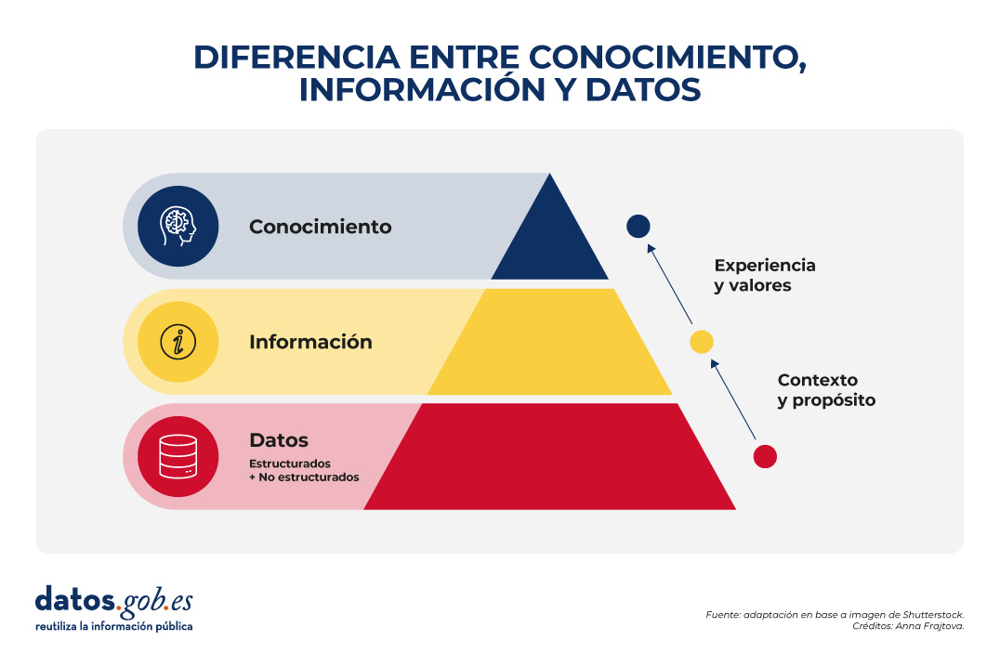
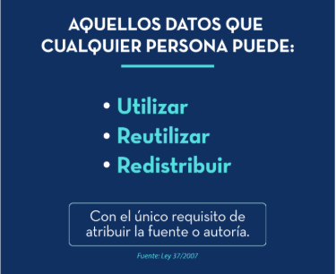
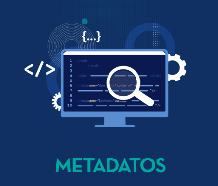
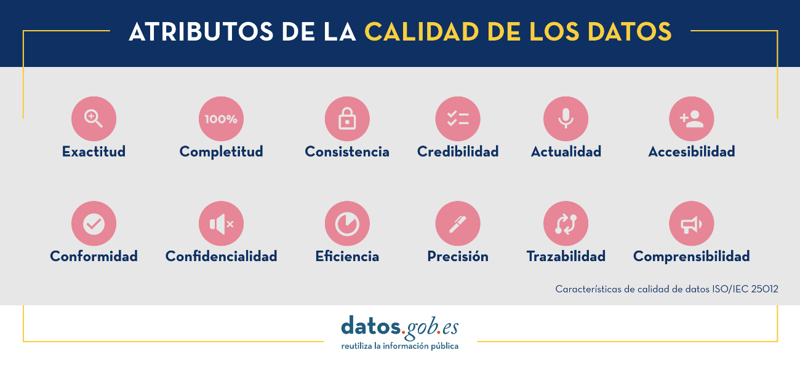
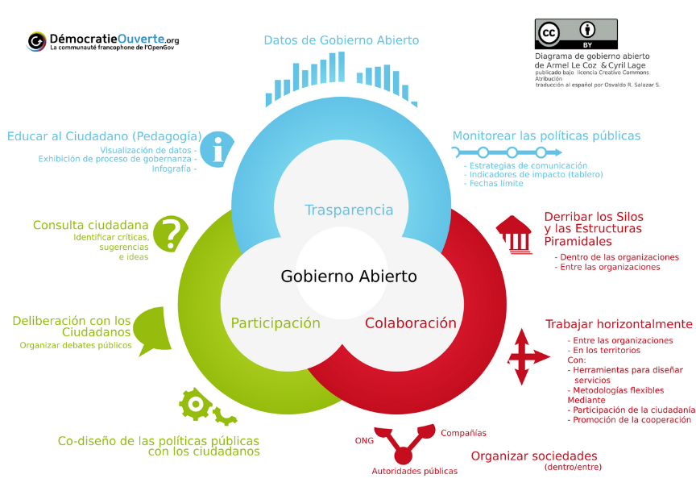
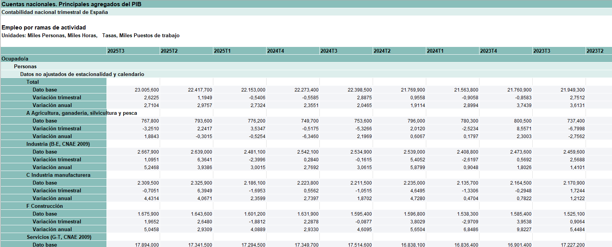
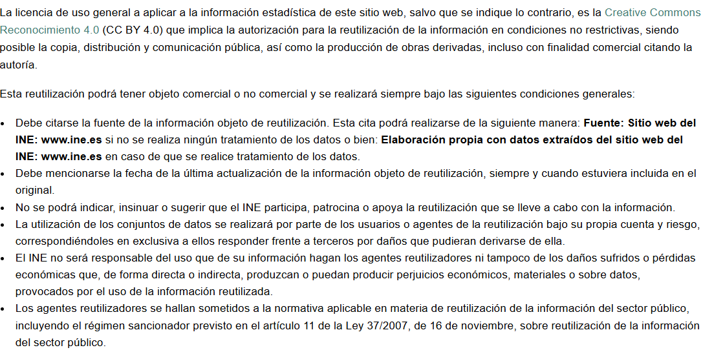
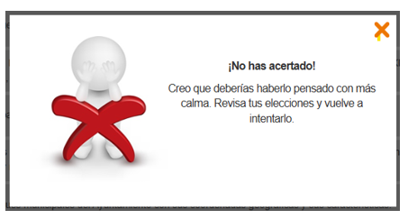
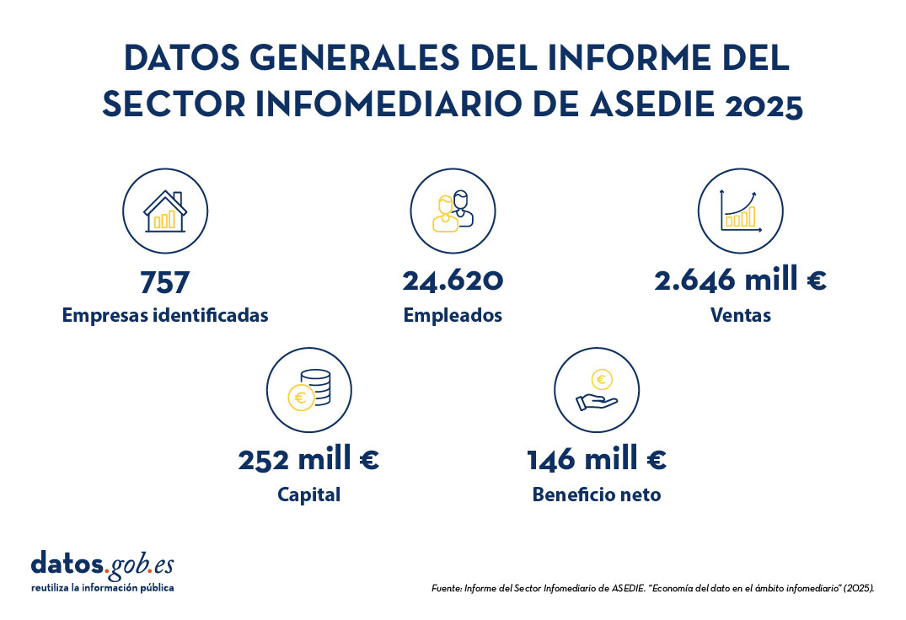

<!--
module_id: unidad-formativa-01
author: Equipo gestor de la plataforma datos.gob.es
email: contacto@datos.gob.es
date: 26/01/2026
version: 1.0.0
language: es
narrator: Spanish Female
mode: Textbook
title: Unidad 01 - Datos abiertos: conceptos básicos y beneficios
comment: Esta unidad presenta los conceptos básicos, principios y beneficios de los datos abiertos.
long_description: Unidades didácticas. Unidad 01 - Datos abiertos: conceptos básicos y beneficios. Más información en [datos.gob.es](https://datos.gob.es/)

edit: true

repository: https://github.com/datosgobes/unidad-formativa-01

logo:     https://cdn.jsdelivr.net/gh/datosgobes/materiales-formativos@main/assets/img/logo_dge_square.svg

icon:     https://cdn.jsdelivr.net/gh/datosgobes/materiales-formativos@main/assets/img/logo_dge_normal.svg

dark:   false

script: https://cdn.jsdelivr.net/chartist.js/latest/chartist.min.js

link: https://fonts.googleapis.com/css2?family=Montserrat:ital,wght@0,100..900;1,100..900&display=swap
      https://cdn.jsdelivr.net/gh/datosgobes/materiales-formativos@main/assets/css/dge-styles.css

font: Montserrat

import: https://raw.githubusercontent.com/liaScript/mermaid_template/master/README.md

import: https://raw.githubusercontent.com/LiaTemplates/Communica/0.0.2/README.md

attribute: Iniciativa de datos abiertos del Gobierno de España [CC BY 4.0](https://creativecommons.org/licenses/by/4.0/)
-->

# Unidad 01 - Datos abiertos: conceptos básicos y beneficios

<ul class="logo-list primary-logos">
	<li></li>
	<li></li>
	<li></li>
</ul>

[preview-lia](https://raw.githubusercontent.com/datosgobes/unidad-formativa-01/refs/heads/main/README.md)

	

		<a href="https://github.com/datosgobes/unidad-formativa-01/releases/download/latest/documentation-unidad-formativa-01.pdf" target="_blank" rel="noopener" class="pdf-download-btn">
			📄 PDF
		</a>
		<a href="https://github.com/datosgobes/unidad-formativa-01/releases/download/latest/scorm-unidad-formativa-01.zip" target="_blank" rel="noopener" class="pdf-download-btn">
			📦 SCORM
		</a>
		<a href="https://github.com/datosgobes/unidad-formativa-01/releases/download/latest/ims-unidad-formativa-01.zip" target="_blank" rel="noopener" class="pdf-download-btn">
			📚 IMS
		</a>
	

	
Descargar documentación en múltiples formatos

	

		Esta unidad ha sido elaborado en el marco de la <a href="https://datos.gob.es/es/que-hacemos" target="_blank" rel="noopener">Iniciativa Aporta (datos.gob.es)</a>, desarrollada por el <a href="https://digital.gob.es/" target="_blank" rel="noopener">Ministerio para la Transformación Digital y de la Función Pública</a> a través de la <a href="https://www.red.es/" target="_blank" rel="noopener">Entidad Pública Empresarial Red.es</a>
	

	 
	

		<strong style="font-size:1.05em;">📝 Aviso legal</strong>
	

	

	Esta obra está sujeta a una licencia Atribución 4.0 de Creative Commons (CC BY 4.0). Está permitida su reproducción, distribución, comunicación pública y transformación para generar una obra derivada, sin ninguna restricción, siempre que se cite al titular de los derechos (<i>Ministerio para la Transformación Digital y de la Función Pública a través de la Entidad Pública Empresarial Red.es</i>). La licencia completa se puede consultar en: <a href="https://creativecommons.org/licenses/by/4.0" target="_blank" rel="noopener">Attribution 4.0 International</a>
	

## TUTORIAL

{{|>}}
*************************************************************************************************************

	

		<i class="icon icon-warning" style="font-size:0.9em;"></i> Aviso
	

	

		

			Este curso está diseñado en <a href="https://liascript.github.io/" target="_blank" rel="noopener">LiaScript</a>. Para disfrutarlo con todas sus funcionalidades, accede a 
			<a href="https://liascript.github.io/course/?https://raw.githubusercontent.com/datosgobes/unidad-formativa-01/refs/heads/main/CURSO.md" target="_blank" rel="noopener">este enlace</a>.
		

		

			Para conocer más sobre el formato Markdown utilizado por LiaScript, consulta la <a href="https://liascript.github.io/course/?https://raw.githubusercontent.com/liaScript/docs/master/README.md" target="_blank" rel="noopener">documentación oficial</a>.
		

	

 

	{{1}}
Puedes navegar el curso a través del índice de la parte izquierda o usando las flechas de navegación del teclado o de la parte inferior de la web.

	{{2}}
Al finalizar cada sección, tendrás la oportunidad de responder preguntas para comprobar tu aprendizaje. Estas actividades solo están disponibles en la versión LiaScript, no en Markdown estándar.

??[Cuestionario](https://liascript.github.io/course/?https://raw.githubusercontent.com/datosgobes/unidad-formativa-01/refs/heads/main/CURSO.md#cuestionario-final)

	{{3}}
Existe la opción de seleccionar otro idioma para el curso usando la traducción -si existe aparecen listados- o seleccionando el servicio de traducción automática con un solo clic. Ten presente que la traducción automática puede contener errores o interpretaciones incorrectas de algunos conceptos.

	{{4}}
El curso incluye secciones con narración de audio. Puedes activar o desactivar la narración utilizando el botón situado en la parte superior de cada página.

*************************************************************************************************************>

## INFORMACIÓN INICIAL

__Título de la unidad__

¿Qué son los datos abiertos? Conceptos básicos, principios y beneficios.

__Descripción de la unidad__

En esta unidad se presentan las definiciones de los conceptos básicos necesarios para comprender qué son los datos abiertos y cómo se utilizan. Se explican cuestiones clave como: qué son los datos, qué los convierte en abiertos, para qué sirven, qué son los datos abiertos públicos y qué implica su reutilización en el sector público. Además, se detallan los principios fundamentales que garantizan que los datos abiertos sean accesibles y fáciles de reutilizar. Finalmente, se exponen los beneficios que aporta la apertura de este recurso, tanto en el ámbito económico y social como en el marco del gobierno abierto y la transparencia.

---

!?[Vídeo descriptivo de la unidad](https://www.youtube.com/watch?v=UM9aGVdHuyU)

## OBJETIVOS DIDÁCTICOS

{{|>}}
*************************************************************************************************************

Comenzamos presentando los **Objetivos didácticos** de esta Unidad:

> - Establecer **conceptos básicos** relacionados con los datos abiertos tomando como referencia el marco legislativo vigente en España.
> - Reconocer los **principios generales** a tener en cuenta para asegurar que los datos abiertos son fácilmente reutilizables.
> - Descubrir los principales **beneficios económicos y sociales** que supone la apertura de datos públicos.
> - Conocer los **aspectos clave ligados al ecosistema de los datos** de cara a asegurar la generación de los beneficios apuntados.

*************************************************************************************************************

## REQUISITOS PREVIOS

Para poder asimilar los conceptos que vamos a desarrollar en la unidad:

> - [x] No se precisan conocimientos previos.

## CONTENIDOS

**Resumimos los aspectos a tratar en los apartados de la Unidad:**

> **[1. INTRODUCCIÓN](#introduccion)**  
>
>> Contextualiza el papel de los datos en la sociedad y por qué los datos del sector público, publicados como abiertos, generan valor.

> **[2. CONCEPTOS CLAVE](#conceptos-clave)**
>
>> Define los conceptos fundamentales (dato, datos abiertos, licencia, HVD, metadatos, catálogo, RISP, calidad de datos y gobierno abierto).

> **[3. PRINCIPIOS DE APERTURA DE DATOS](#principios)**
>
>> Presenta los marcos de referencia más comunes para publicar datos reutilizables: principios OGD y principios FAIR.

> **[4. BENEFICIOS DE LA REUTILIZACIÓN DE DATOS ABIERTOS](#beneficios)**
>
>> Resume beneficios económicos, sociales y para la propia Administración, con ejemplos y fuentes.

> **[5. CUESTIONARIO FINAL](#cuestionario-final)**
>
>> Autoevaluación final para comprobar el aprendizaje.

> **[6. RESUMEN](#resumen)**
>
>> Ideas clave de la unidad y cierre.

## 1. INTRODUCCIÓN

En la sociedad actual **los datos se han convertido en un activo fundamental**, tanto para las personas como para las organizaciones. El dato, y su papel esencial en el desarrollo de tecnologías disruptivas como la inteligencia artificial, supone el factor diferencial de la revolución industrial y tecnológica en la que nos encontramos inmersos.

Los datos generados por las administraciones públicas fruto de su actividad —los **datos del sector público**— despiertan un gran interés:

- Para la ciudadanía, porque son una herramienta clave para la **transparencia y la participación democrática**.
- Para las empresas, porque representan una fuente valiosa para **mejorar la competitividad** en distintos sectores.
- Para las propias administraciones, porque facilitan la **definición y optimización de políticas públicas**.

Los datos producidos por las administraciones en el ejercicio de sus funciones deben ponerse a disposición de la sociedad como **datos abiertos**: **accesibles y disponibles para todos, sin restricciones legales ni técnicas**.

Los datos procedentes de múltiples ámbitos —geográfico, medioambiental, meteorológico, turístico, empresarial, educativo, entre otros— conforman un conjunto amplio, diverso y valioso. Publicados como datos abiertos, pueden y deben generar beneficios para toda la sociedad.

## 2. CONCEPTOS CLAVE

Como punto de partida se definen los conceptos básicos que se manejan al hablar de datos en general y de datos abiertos en particular. Se toma como referencia el marco legislativo vigente en España.

### 2.1. Bloque I: conceptos básicos

> **Dato:** toda representación digital de actos, hechos o información, así como su recopilación, incluso como grabación sonora, visual o audiovisual.  
> Fuente: https://www.boe.es/buscar/act.php?id=BOE-A-2010-1331

Los datos pueden ser **estructurados** y **no estructurados**:

- **Estructurados**: tienen bien definidos su longitud y su formato (fechas, números, cadenas de caracteres). Se almacenan en tablas.
- **No estructurados**: carecen de un formato específico y no se pueden almacenar directamente en una tabla (PDF, multimedia, e-mails, documentos de texto, etc.).

Los datos se convierten en **información** cuando se les proporciona un contexto. El **conocimiento** es lo que se obtiene de la información cuando esta se interpreta en función de la experiencia y valores.

**Ejemplo**

- Dato: 15°C
- Información: La temperatura en Valladolid hoy es de 15°C.
- Conocimiento: Si la temperatura en Valladolid es de 15°C en enero, es inusualmente alta, lo que puede indicar un cambio climático o una anomalía meteorológica.

> **Datos abiertos:** son aquellos que cualquiera es libre de utilizar, reutilizar y redistribuir, con el único límite, en su caso, del requisito de atribución de su fuente o el reconocimiento de su autoría.  
> Fuente: https://www.boe.es/buscar/act.php?id=BOE-A-2007-19814

Esta definición identifica tres características esenciales:

- **Uso libre**: pueden emplearse para cualquier finalidad, incluida la comercial.
- **Reutilización**: posibilidad de transformar, combinar o enriquecer los datos.
- **Redistribución**: posibilidad de compartir datos originales o derivados.

**Lo que NO son datos abiertos**

- Datos publicados sin licencia clara (genera inseguridad jurídica).
- Datos accesibles solo previo registro o pago.
- Datos con restricciones de privacidad o seguridad (p. ej. datos personales).

**Tip (ejemplos)**

- Un ayuntamiento publica sus presupuestos anuales como datos abiertos → ciudadanía y periodistas pueden analizarlos.
- El Ministerio de Transportes ofrece datos de tráfico en tiempo real → desarrolladores crean aplicaciones de movilidad.
- El Instituto Nacional de Estadística publica datos demográficos → investigadores los usan para estudios socioeconómicos.

> **Licencia abierta:** acuerdo legal que otorga permisos de libre uso, modificación y distribución de un recurso (datos, textos, software, contenido multimedia…), exigiendo únicamente el reconocimiento del autor y, en su caso, la continuidad de la propia licencia.

Las licencias **Creative Commons (CC)** son un ejemplo popular para contenidos y datos.

**Ejemplo**

El Instituto Geográfico Nacional ofrece información geográfica digital de España reutilizable y gratuita bajo **CC-BY 4.0**.  
Fuente: https://centrodedescargas.cnig.es/CentroDescargas/politica-datos

> **Datos abiertos gubernamentales / del sector público:** datos generados, creados, recolectados, procesados, preservados, mantenidos, diseminados o financiados por un gobierno o una institución pública, considerando los requerimientos y restricciones legales que permiten su reutilización (licencia abierta).

**Las administraciones públicas son los principales proveedores de datos abiertos**. Por ello, con frecuencia, “datos abiertos” se refiere a datos oficiales gubernamentales disponibles como abiertos.

**Ejemplo**

El Instituto Nacional de Estadística (INE) publica datos de población y los actualiza periódicamente.  
Fuente: https://www.ine.es/dyngs/INEbase/categoria.htm?c=Estadistica_P&cid=1254735572981

> **Datos abiertos de alto valor (HVD):** datos cuya reutilización está asociada a considerables beneficios para la sociedad, el medio ambiente y la economía.

En enero de 2023, la Comisión Europea define seis categorías para diferenciar los datos de alto valor.  
Fuente: https://www.boe.es/buscar/doc.php?id=DOUE-L-2023-80077

> **Datos protegidos:** datos en poder de organismos del sector público protegidos por confidencialidad comercial, confidencialidad estadística, derechos de propiedad intelectual de terceros o protección de datos personales.

**Tip**

Los datos protegidos no pueden disponerse como datos abiertos cuando concurren derechos de terceros que dificultan su reutilización (por ejemplo, datos personales o con propiedad intelectual de terceros).

### 2.2. Bloque II: conceptos relacionados con la publicación

> **Conjunto de datos:** datos relacionados, estructurados y organizados de forma que puedan ser tratados (procesados) apropiadamente para obtener información.

**Ejemplo**

La Dirección General de Tráfico (DGT) publica un conjunto de datos (XLS) con series históricas de matriculaciones desde 1998 a 2024.  
Fuente: https://datos.gob.es/es/catalogo/e00130502-matriculaciones-series-historicas-2024

> **Servicio de datos:** conjunto de operaciones que ofrecen acceso a uno o más conjuntos de datos o funciones de procesamiento permitiendo obtener datos en distintos formatos.

A los servicios de datos se accede principalmente mediante **API** (Interfaz de Programación de Aplicaciones), que actúa como un “puente” para acceder a los datos sin necesidad de conocer la implementación interna.

**Ejemplo**

AEMET publica una API de datos meteorológicos que permite consultar la temperatura actual mediante llamadas programadas.  
Fuente: https://opendata.aemet.es/centrodedescargas/inicio

**Tip**

- El **servicio de datos** es la fuente donde están los datos.
- La **API** es la “puerta” de acceso programático para interactuar con el servicio.

> **Distribución:** información (datos) en un formato concreto, accesible desde una URL específica. Un conjunto de datos puede disponer de una o múltiples distribuciones.

**Ejemplo**

Un mismo recurso puede ofrecerse como servicio API y también como ficheros en distintos formatos (CSV, XLSX, JSON, PC-AXIS…).

> **Metadatos:** datos que definen y describen otros datos. Es información estructurada que describe, explica o localiza un conjunto de datos o un servicio, facilitando su recuperación, utilización o administración.

**Ejemplo de metadatos**

- Título
- Descripción
- Licencia
- Fecha de última actualización
- Otros recursos

> **Catálogo de datos abiertos:** repositorio electrónico donde se almacenan y administran datos abiertos y sus metadatos.

En la práctica, existen catálogos en distintos niveles administrativos (nacional, regional, local) y también meta-catálogo/agregadores que consolidan la búsqueda en múltiples portales.

### 2.3. Bloque III: conceptos relacionados con la reutilización

> **Reutilización de la información del sector público (RISP):** uso de documentos en poder de las Administraciones y organismos del sector público por personas físicas o jurídicas, con fines comerciales o no comerciales, siempre que dicho uso no constituya una actividad administrativa pública.

En España, la RISP se rige por la **Ley 37/2007** en aplicación de la **Directiva Europea 2019/1024**.

- Ley 37/2007: https://www.boe.es/buscar/act.php?id=BOE-A-2007-19814
- Directiva 2019/1024: https://eur-lex.europa.eu/legal-content/ES/ALL/?uri=CELEX%3A32019L1024

> **Calidad de datos:** idoneidad de los datos para servir para múltiples propósitos y para diferentes tipos de usuarios.

La norma ISO/IEC 25012 establece atributos de calidad de datos.

> **Gobierno abierto (Open Government):** doctrina orientada a que la ciudadanía colabore en la creación y mejora de servicios públicos y en el fortalecimiento de la transparencia y la rendición de cuentas.

Se sustenta en tres pilares:

- **Transparencia**
- **Colaboración**
- **Participación**

### Caso de estudio (para practicar)

En el Catálogo nacional (datos.gob.es), un recurso del INE permite observar cómo se relacionan varios conceptos (datos, conjunto de datos, distribuciones, metadatos, licencia…).

- Recurso: https://datos.gob.es/es/catalogo/ea0010587-empleo-por-ramas-de-actividad-cntr2010-identificador-api-67201

### Ejercicio (conceptos básicos)

Asocia cada ejemplo con el concepto correcto.

{{|>}}
*************************************************************************************************************

**1) Los datos de parques municipales del Ayuntamiento en un formato como CSV**

<!-- data-randomize data-max-trials="3" data-show-solution-button="0"-->
- [( )] Dato
- [( )] Conjunto de datos
- [(X)] Distribución
- [( )] Licencia
- [( )] Metadatos
***
> ✅ **¡Correcto!**  
> Una distribución es una representación del conjunto de datos en un formato concreto (CSV, JSON, XLSX...).
***

**2) Una colección descargable con listado de parques, ubicación y características, en varios formatos**

<!-- data-randomize data-max-trials="3" data-show-solution-button="0"-->
- [( )] Dato
- [(X)] Conjunto de datos
- [( )] Distribución
- [( )] Licencia
- [( )] Metadatos
***
> ✅ **¡Correcto!**  
> Un conjunto de datos agrupa datos relacionados con sus metadatos y recursos asociados.
***

**3) Ubicación de los Jardines Gregorio Ordóñez**

<!-- data-randomize data-max-trials="3" data-show-solution-button="0"-->
- [(X)] Dato
- [( )] Conjunto de datos
- [( )] Distribución
- [( )] Licencia
- [( )] Metadatos
***
> ✅ **¡Correcto!**  
> Un dato es un valor o representación de un hecho o información.
***

**4) Condiciones que permiten el uso, reutilización y redistribución de la información**

<!-- data-randomize data-max-trials="3" data-show-solution-button="0"-->
- [( )] Dato
- [( )] Conjunto de datos
- [( )] Distribución
- [(X)] Licencia
- [( )] Metadatos
***
> ✅ **¡Correcto!**  
> La licencia establece las condiciones de uso y reutilización.
***

**5) Información sobre fecha de última actualización, fecha de creación u otros atributos descriptivos**

<!-- data-randomize data-max-trials="3" data-show-solution-button="0"-->
- [( )] Dato
- [( )] Conjunto de datos
- [( )] Distribución
- [( )] Licencia
- [(X)] Metadatos
***
> ✅ **¡Correcto!**  
> Los metadatos describen, explican o ayudan a localizar un conjunto de datos o servicio.
***

*************************************************************************************************************>

## 3. PRINCIPIOS DE APERTURA DE DATOS

Para garantizar que los datos abiertos sean fácilmente utilizables, reutilizables y redistribuibles, es necesario cumplir con una serie de principios reconocidos internacionalmente. A continuación se presentan dos marcos de referencia fundamentales.

### 3.1. Principios Open Government Data (OGD)

En 2007, defensores del gobierno abierto recogieron los **8 principios** de los datos abiertos gubernamentales:

- **Completos**: se ofrecen todos los datos disponibles, salvo restricciones legítimas (privacidad, seguridad…).
- **Primarios**: máximo nivel de granularidad, evitando agregaciones o modificaciones.
- **Oportunos**: disponibles tan rápido como sea necesario para preservar el valor.
- **Accesibles**: para la más amplia gama de usuarios y propósitos.
- **Procesables**: razonablemente estructurados para el procesamiento automatizado.
- **No discriminatorios**: disponibles para cualquier persona bajo las mismas condiciones.
- **No propietarios**: en formatos sobre los que ninguna entidad tiene control exclusivo.
- **De licencia libre**: sin restricciones indebidas por derechos de autor/patentes/marcas/secretos comerciales (salvo límites razonables).

### 3.2. Principios FAIR

Los principios FAIR (**F**indable, **A**ccessible, **I**nteroperable, **R**eusable) ponen el foco en que los datos y metadatos puedan ser encontrados, accedidos, interoperados y reutilizados con mínima intervención humana.

- **Findable (Encontrables)**: identificadores persistentes (URI), metadatos ricos e indexación.
- **Accessible (Accesibles)**: recuperables por identificador mediante protocolos estandarizados.
- **Interoperable (Interoperables)**: uso de lenguajes formales y referencias cualificadas a otros datos/metadatos.
- **Reusable (Reutilizables)**: descripciones detalladas, procedencia y normas comunitarias pertinentes.

### Ejercicio (principios de datos abiertos)

Relaciona cada definición con el principio correcto.

{{|>}}
*************************************************************************************************************

**1) Los datos deben estar disponibles para cualquiera, sin discriminación**

<!-- data-randomize data-max-trials="3" data-show-solution-button="0"-->
- [(X)] Accesibles
- [( )] Completos
- [( )] Procesables
- [( )] No propietarios
***
> ✅ **¡Correcto!**  
> Accesibles implica que estén disponibles para la más amplia gama de usuarios y propósitos.
***

**2) Todos los datos públicos deben estar disponibles salvo restricciones legítimas**

<!-- data-randomize data-max-trials="3" data-show-solution-button="0"-->
- [( )] Accesibles
- [(X)] Completos
- [( )] Procesables
- [( )] No propietarios
***
> ✅ **¡Correcto!**  
> Completos implica publicar todo lo disponible, salvo privacidad o seguridad.
***

**3) Los datos deben estar estructurados para permitir procesamiento automatizado**

<!-- data-randomize data-max-trials="3" data-show-solution-button="0"-->
- [( )] Accesibles
- [( )] Completos
- [(X)] Procesables
- [( )] No propietarios
***
> ✅ **¡Correcto!**  
> Procesables significa que pueden ser tratados por sistemas de forma automatizada.
***

**4) Los datos deben publicarse en formatos sin control exclusivo de una entidad**

<!-- data-randomize data-max-trials="3" data-show-solution-button="0"-->
- [( )] Accesibles
- [( )] Completos
- [( )] Procesables
- [(X)] No propietarios
***
> ✅ **¡Correcto!**  
> No propietarios evita dependencias de formatos cerrados.
***

*************************************************************************************************************>

## 4. BENEFICIOS DE LA REUTILIZACIÓN DE DATOS ABIERTOS

Los datos que obran en manos de las Administraciones Públicas tienen un gran potencial para la generación de **beneficios económicos, sociales y para las propias administraciones**. Además, son pieza clave para nuevos nichos de valor como la **inteligencia artificial** o los **espacios de datos**.

### 4.1. Beneficios económicos

La reutilización de datos abiertos permite optimizar procesos empresariales y encontrar soluciones a retos corporativos a través del análisis de información.

**Ejemplo (España)**

El Informe del Sector Infomediario de ASEDIE (2025) recoge, para 2023, un beneficio neto estimado de 146 millones de euros para empresas reutilizadoras.  
Fuente: https://www.asedie.es/es/informes-anuales

**Ejemplo (Europa)**

La Comisión Europea estimó un tamaño de mercado directo de los datos abiertos en Europa (2016-2020) de 325 mil millones de euros.  
Fuente: https://data.europa.eu/sites/default/files/re-using_open_data.pdf

### 4.2. Beneficios sociales

El uso de datos abiertos puede generar mejoras sociales cuantificables, por ejemplo:

- Reducir tiempos de respuesta ante emergencias.
- Optimizar rutas y uso del transporte público.
- Ayudar a disminuir consumos energéticos con información y recomendaciones.

Además, los datos abiertos democratizan el acceso a la información, habilitan el periodismo de datos e impulsan la participación ciudadana.

### 4.3. Beneficios para la propia Administración

Para las Administraciones Públicas, la reutilización de la información del sector público contribuye a:

- **Derecho al conocimiento** y rendición de cuentas.
- **Participación ciudadana** mediante proyectos colaborativos.
- **Acercamiento a ciudadanía y empresas** eliminando barreras de acceso y favoreciendo el intercambio de datos.

### Ejercicio (beneficios)

Indica si las siguientes afirmaciones son verdaderas o falsas.

{{|>}}
*************************************************************************************************************

**1) La publicación de datos abiertos puede favorecer la transparencia**

<!-- data-randomize data-max-trials="2" data-show-solution-button="0"-->
- [(X)] Verdadero
- [( )] Falso
***
> ✅ **¡Correcto!**  
> Los datos abiertos facilitan la rendición de cuentas y el control social.
***

**2) Los datos abiertos solo generan beneficios para empresas**

<!-- data-randomize data-max-trials="2" data-show-solution-button="0"-->
- [( )] Verdadero
- [(X)] Falso
***
> ✅ **¡Correcto!**  
> También generan beneficios sociales y mejoras para la propia Administración.
***

**3) La reutilización de datos puede impulsar nuevos servicios y aplicaciones**

<!-- data-randomize data-max-trials="2" data-show-solution-button="0"-->
- [(X)] Verdadero
- [( )] Falso
***
> ✅ **¡Correcto!**  
> Reutilizar implica transformar y combinar datos para generar nuevo valor.
***

*************************************************************************************************************>

## 5. CUESTIONARIO FINAL

Pon a prueba tu aprendizaje con este cuestionario final.

{{|>}}
*************************************************************************************************************

### 1) Verdadero o falso

Los datos abiertos deben publicarse en formatos no propietarios y procesables por máquina.

[[X]] Verdadero
[[ ]] Falso

[[?]] Pista: recuerda los principios OGD.

---

### 2) Completa la frase

Los principios FAIR significan Findable, Accessible, Interoperable y [[Reusable]].

[[?]] Pista: es la “R” final.

---

### 3) Selección

Un dato de alto valor (HVD) es aquel cuya reutilización está asociada a importantes beneficios para la sociedad, el medio ambiente y la [[economía]].

[[?]] Pista: se cita junto a “sociedad” y “medio ambiente”.

---

### 4) Completa

Un mismo conjunto de datos puede tener múltiples [[distribuciones]] (por ejemplo, CSV, XLSX, JSON, PC-AXIS…).

[[?]] Pista: se refiere al formato concreto accesible desde una URL.

---

### 5) Respuesta corta

La reutilización de la información del sector público en España se rige por la Ley [[37/2007]].

[[?]] Pista: es la ley de reutilización de la información del sector público.

*************************************************************************************************************>

## 6. RESUMEN

- Las administraciones públicas impulsan políticas de **datos abiertos** para favorecer un nuevo modelo de relación administración–ciudadanía.
- Los datos abiertos deben atender a **principios generales** para ser fácilmente utilizables, reutilizables y redistribuibles.
- La apertura y reutilización de datos aporta **beneficios** a la economía, la sociedad y las propias administraciones.

Si quieres saber más sobre la Iniciativa Aporta, visita https://datos.gob.es/
